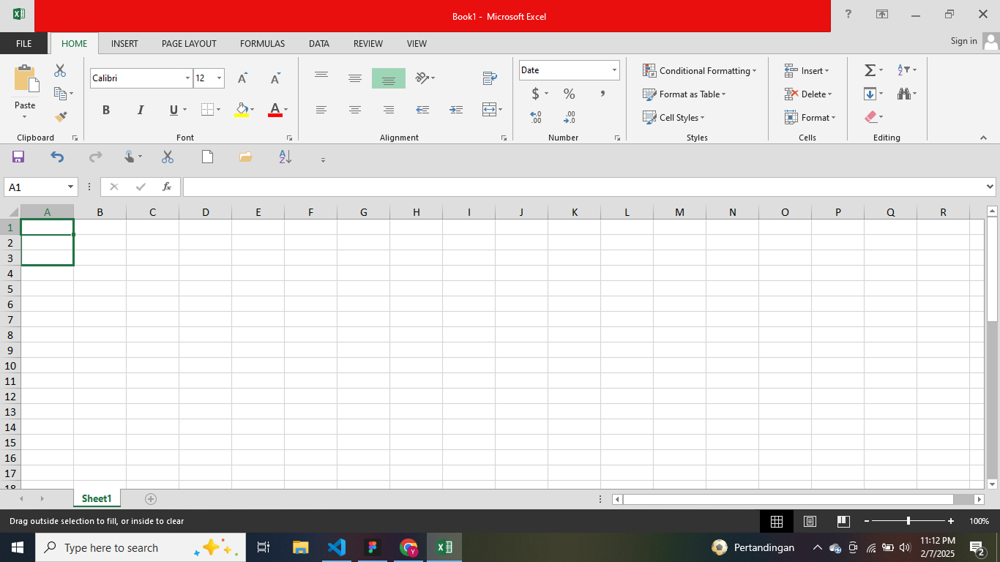
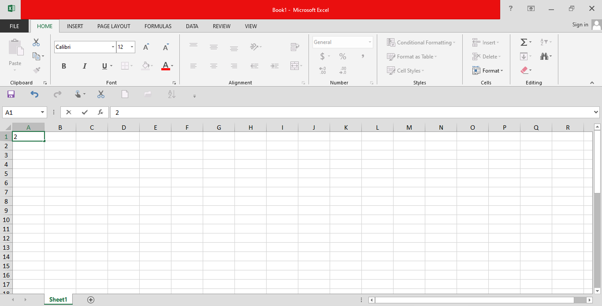
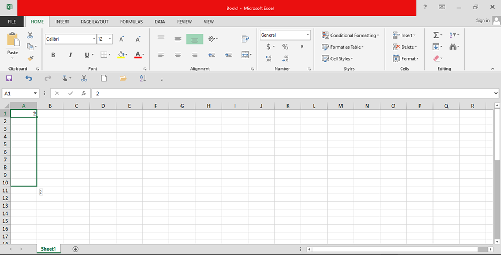
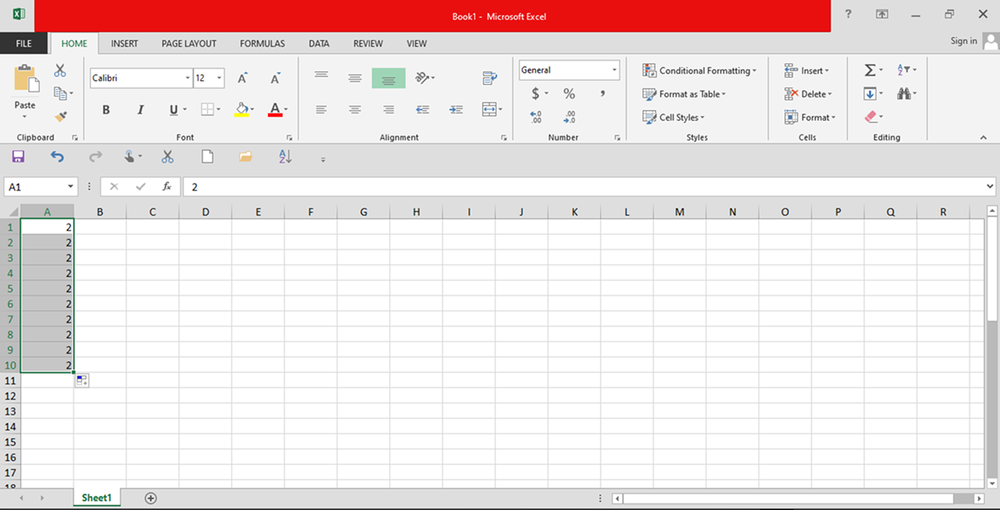
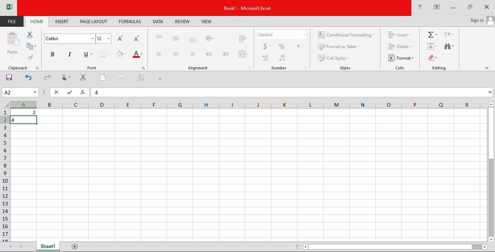
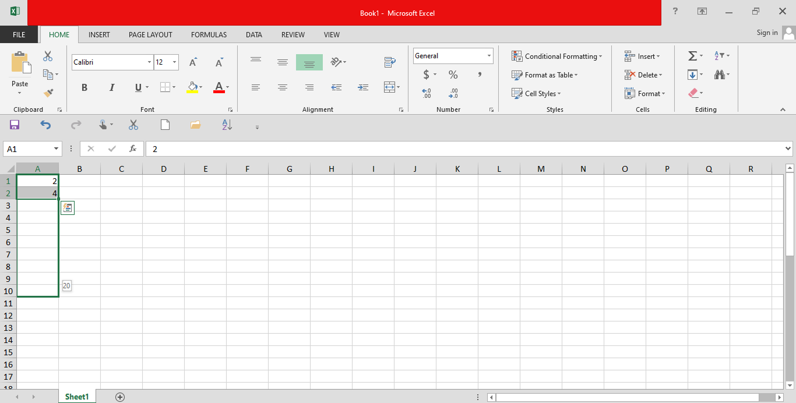
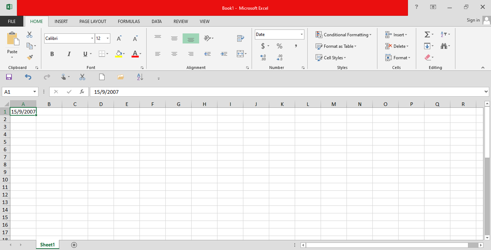
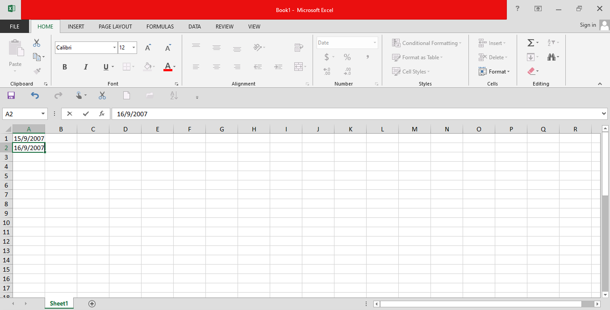
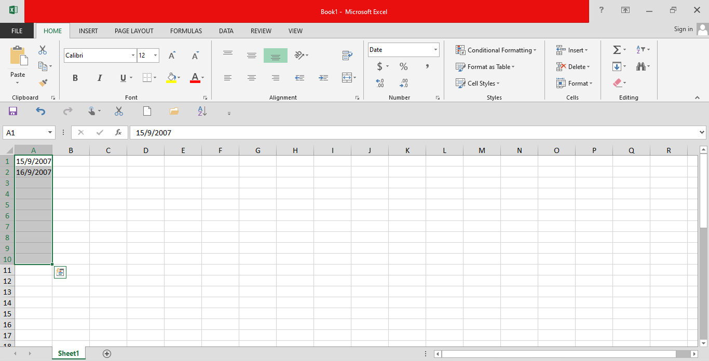

# Excel Fill

Fill Disini Dimaksud Kan Yaitu Dari Pada Kita Capek Capek Ketik Satu Satu Dan Manual Di Excel Itu Ada Beberapa Cara Untuk Fill Atau Isi Dan Isi Ini Dapat Di Pakai Untuk Ini

- Tanggal
- Salin
- Urutan
- Funsgi

Pada Dasar Nya Di Excel Untuk Menduplikasi Atau Mengisi Bisa Mengunakan Sebuah Fitur Ini. Yaitu Pada Saat Kita Menekan Sebuah Sel Nani Akan Ada Sedikit Tanda Kotak Kecil Di Ujung Kiri Bawah, Dan Kalo Misal Nya Kau Tekan Mouse Kiri Di Situ Dan Menyeret Ke Bawah Ntr Bisa Duplikasi. Dan Juga Pada Saat Menduplikasi Nnti Crosir Kita Berubah Yang Tadi Nya Gambar Pesawat Kertas Dan Berubah Jadi Tanda `+` Oke Kita Lihat Di Gambar Ini

---

## Info

**Tanda Duplikasi**

**CrosAir Untuk Duplikasi**

---

## Cara Menyalin 

**Menggunakan Duplikasi Icon**
    langkah lankah

1. pilih sel

2. masukan angka di sell pertama

3. clikc icon kotak di bawah kanan dan seret ke bawah 

4. jika sudah sampai tujuan sel nya lepas mousekiri
5. dan walla jadi

**Menggunakan Shorcut**
    langkag langkah

1. pilih sel

2. masukan angka di sell pertama

3. klik pada sel yang di isi velue dan tekan `shift` sampai tujuan

4. jika sudah sampai tujuan tekan `ctrl` + `d`
5. dan walla udha jadi

---

## cara Menyalin

oke untuk cara nyalin ini di atas kan udh gw jelasin yak tap ada lagi yg belum kita disini jangan fokus smaa fungsi dulu kita bahas nnti aj itu
oke kita lanjut

cara menanyalin tadi kan pakai angka ya nah sekarang gimana kalau pakai huruf aja 
gini langkah langkah nya

1. pilih sel

2. masukan kata bebas di sell pertama

3. clikc icon kotak di bawah kanan dan seret ke bawah 

4. jika sudah sampai tujuan sel nya lepas mousekiri
5. dan walla jadi

nah jadi udah paham kan kekman cara nyalin yg benar
---

## Isi Irutan

nah ini mirip juga kayak salin tapi bedanya ini itu dia berurutan angka nya kalu tadikan dia angka 1 aja misak kita duplikasi ke bawah kalai ini bukan bikin 1 10x tapi bikin 1 samapi 10 

gmn cara nya?

1. pilih sel

2. masukan angka 1 di sell pertama

3. masukan angka 2 di sell kedua

4. clikc icon kotak di bawah kanan dan seret ke bawah 

5. jika sudah sampai tujuan sel nya lepas mousekiri
6. dan walla jadi

jadi kita bukan lagi menduplikasi tapi membuat angka 1 sampai 10 misal kalai kita duplikasi sampai 10

>[!NOTE]
>PASTKAN POLA DARI ANGKA NYA ITU DAPAT DI EKNALI OLEH SISTEM JANGAN ADA HURUF ATAU APA GITU

---

## Isi Urutan Tanggal

kalau tadi kan angka selaran kita pakai tanggal 
nah jadi sistem nya itu ada 2 jenis tanggal ada yang memsishakan bulan tahun dan tanggal nya dnegn `.` dna ada juga dnegna `/`
contoh nya gini

1. pilih sel

1. masukan tanggal di sel pertama

1. masukan tanggal di sel kedua

1. clikc icon kotak di bawah kanan dan seret ke bawah 

1. jika sudah sampai tujuan sel nya lepas mousekiri
2. dan walla jadi

jadi ini trgntung pada kalian aja pakai yg mana

>[!NOTE]
>PASTIKAN EMNGUNAKAN TANGGAL SEBENARNAY KARNA JIKA TDIAK MAKA AKAN MENYEBABKAN ERROR

---

## Gabungin Kata Sama Hurup

oke kalau ini agak sedikit berbeda ya karna ini bisa menggbaiungkan kata dnegan huruf oke langsung aja ke tutorila nya

1. pilih sel

1. masukan angka dan huruf yang sama di sel pertama

1. masukan angka dan huruf yang sama di sel kedua

1. clikc icon kotak di bawah kanan dan seret ke bawah 

1. jika sudah sampai tujuan sel nya lepas mousekiri
2. dan walla jadi

>[!NOTE]
>PENGABUNGAN KATA DAN HURUF CUMAN NGUBAH NILAI ANGKA NYA JA BUKAN KATA NYA DAN JUGA PASTIKAN DALAM MEMBUAT INI JANGAN ADA TYPO KARNA TYPO DIKIT AJA SI EXCEL NYA NGANGAP NYA BEDA JAID G DI EKSEKUSI

## PENUTUP

oke lah munggkin segini aja dulu lanjur lagi ke pembelajran selanjur nya yaitu

---