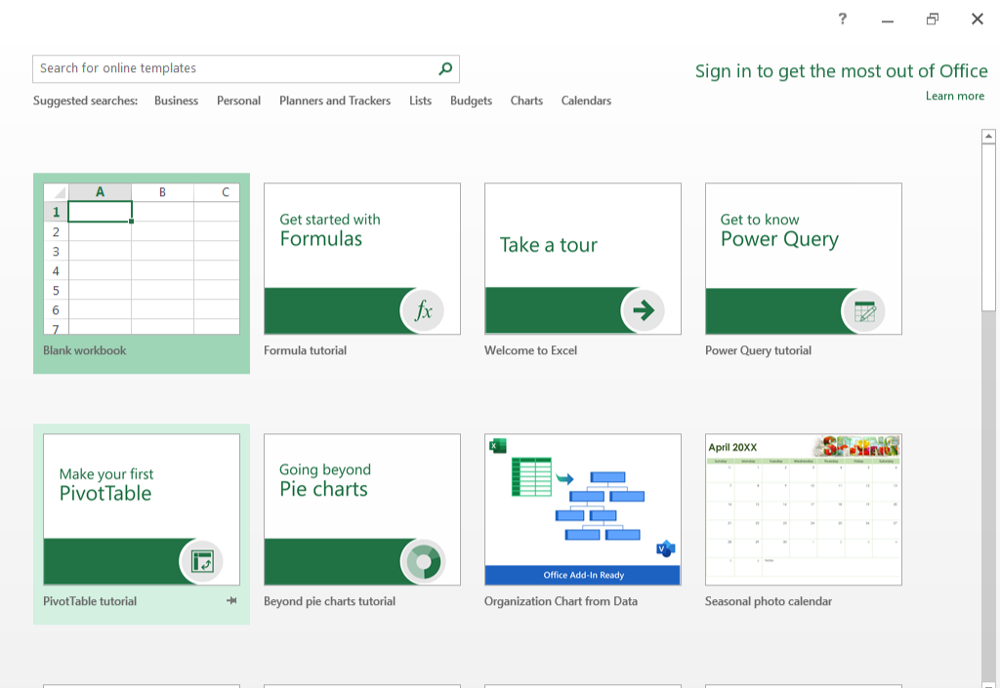
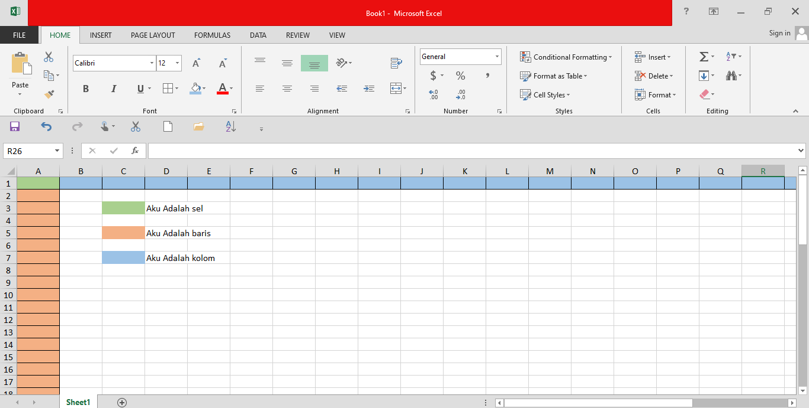

# EXCEL GET STARTED

cara untuk belajar execel iatu ada 2 yang pertama pakai office 365 atau aplikasi excel nya langsung
pai kali ini syaa mengunakan excel langsung oke kita mulai 

## Cara Untuk Memulai excel

1. **Clik Icon excel Di desktop atau cari di penacrian `"Excel"`**

2. **Lalu Kalian clik `blank workbook`**

3. **Tampilan Utama Dari excel**

>[!NOTE]
>Disini Saya Mengunakan Excel 2010 jika kalian mengunakan yang versi lain atau kalian mengunakan office 356 juga gapapa sama aja

### buat yang baru tau excel kali dan pusibg atau bingun ini apa oke disini syaa jelaskan 

## Pengertian Nya
- kolom
- baris
- sel

nah mungkin kalain g asing atau pernah dengan kata ini kan?, nah itu apasi?
oke kalau kolom atau `columns` itu yang ada kotak kotak tapi dia huruf dari `A` TERUS `B` dan seterus nya atau biar gampang aja kolom itu kotak kotak yang berjejer secara horizontal atau kanan ke kiri bukan atas atau bawah.

kalau baris itu istilah nya `rows` atau `line` atau apalah nah inti nya si baris ini itu kebalikan dari kolom kalau kolom kan kotak kota ynag berjejer ke kanan atau ke kiri nah klau baris itu kotak kotak yang berjejer ke atas dan ke bawah nah si baris ini itu mulai dari anggka `1` atau `2` sampai seterus nya.

kalau sel itu adalah gabungan antara kolom dan baris misal nya gini ada sebuah warna unggu ang terletak di sel ini

    kolom = A
    baris = 8
    sel = A8

| A   | B                                |
|-----|----------------------------------|
| A1  |                                  |
| A2  |                                  |
| A3  |                                  |
| A4  |                                  |
| A5  |                                  |
| A6  |                                  |
| A7  |                                  |
| A8  | < -- aku adalah sel ke A8        |

**Untuk Contoh Nya Liat gambar Ini**

## penutup

Oke Jadi Sebelum kalian lanjut ke tahap selnajut nya kalian **wajib bisa** karna ini sangat penting

---

lanjut ke 

