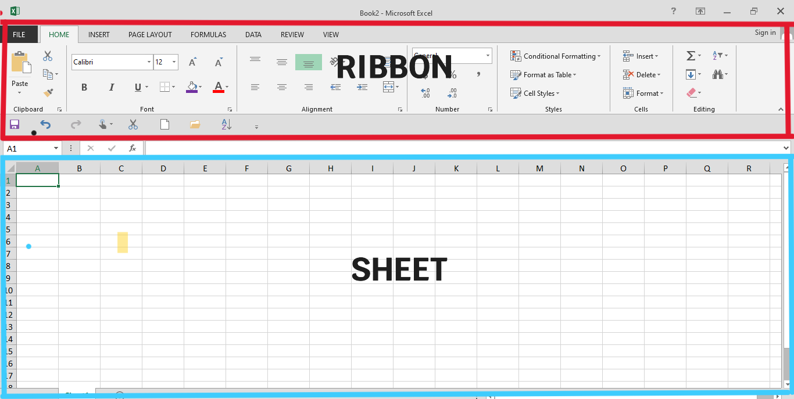
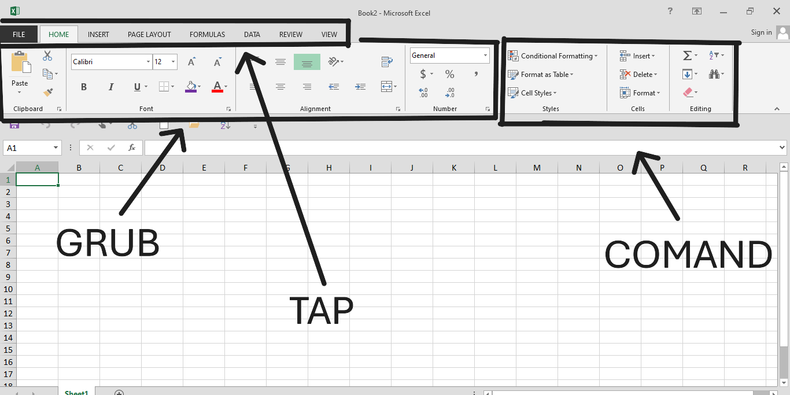

# EXCEL OVERWIRE

Oke Jadi di bab ini kita kana membahas funsi fungsi dasar hud nya dulu atau ui nya.
Nah di excel itu ada 2 jenis di halaman default nya

1. ribbon
2. sheet

---

## Apa itu RIBBON ?

nah jadi `RIBBON` itu adalah tempay untuk menavigasi berbagai hal misal nya mau buat tabel mau ubah warna font dan banyak lagi itu tugas nya si ribbon

## Kalau Sheet ?

nah kalau sheet itu dimana letak untuk mengessekusi dari perintah nya si ribbon misal kita mau ubah warna sell atau membuat border
nah itu kita input di bagian `SHEET`

## Macam Macam Ribbon

### penjelasan

- GRUB
- TAP
- COMAND

---

**Tap** adalah tempat kita di mana kita mau menavigasikan kayak tap insert atau tap home dan lain lain
**commad** kalau tap ini bertujuan memberikan itndakan pada perintah
**grub** kalau grub adalh funsgi utaman dari yap atau kelompok kelompok aalat yang bisa yang bisa merubah menganti atau apapun itu

---

## Sheeet 
apa itu sheet kalau sheet itu lembarkerja yang kotak kotak itu  dan kalian juga bisa membuat sheet baru tanpa membuat file baru lagi cukup mengclik icon `+` di bagian bawah maka sheet baru akan terbentuk dan kalaan juga bisa mengubah nama sesuai kebutuhan.

## penutup

oke tetap semangat bab selanjut nya kita belajar tentang `Sintax Excel`
clik untuk ke bab selanjut nya

