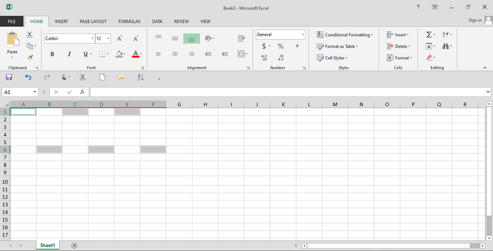

# EXEL RANGERS

oke kali ini kita bahas apa itu range di excel.
kan tadi sebelum nya kita udha pernah bahas apa itu sel,kolom,dan baris masig ingat?
jika tidak tau atau kau langsung ke sini silahkan clik badge di bawha ini

---

oke sebelum kita ke apa itu range kita waji tau dulu nama nya adalah `Kotak Kordinat` sebenar nya gua g tau nama nya apa ini gua bikin sendiri tapi kalau kalian bikin nya lain juga gappaa,oke balik lagi apa itu `KOTAK KORDINAT`?

jadi kotajk kordinat itu kotak yang berfungsi untuk lokasi atau kordinat sbeuah sell dan `KOTAK KORDINAT` ini beradadi kanan pjok atas 

nah jadi misal kita pilih salah satu sel nanti kordinat sel itu akan muncul di kotak itu contoh nya gini

Gimana Udah Tau kan Fungsi nya sebenar nya maish banyak lagi fungsi nya itu tapi kapan kapan akn kita bahas

Oke Kita Lanjut ke

## Apa itu Range

range itu adalah kumpulan sel sel. maksud?, oek mungkin kalian masih belum faham kan jadi gini kan sel itu ada alamat nya masing maisng kan kyak `A1` atau `C10` dan masih bnayk lagi
nah kalau range itu adalah blok atau kelompok nya sel.
nah untuk ngeblok atau range itu ada 4 metode

- pilih baris
- pilih colom
- pilih beberapa baris
- pilih beberapa colom
- pilih beberapa sell
- blok sell

## Penjelasan

### PILIH BARIS

jadi pilih baris itu kita bisa memilih seluruh sel yang ada di baris itu misla nya gini, kita milih baris ke `5` maka seluruh sel yang ada di baris ke `5` itu akan `ter blok` atau terseleksi untuk di opearikan 

contoh nya gini

---

### Pilih KOLOM
Kalau pilih kolom itu sma aja kayak pilih baris tapi bedanya cuman kolom aja dia

contoh nya gini

---

### Pilih beberapa baris 
kalau ini sama aja kayuak pilih baris tapi bedanya cuman ini dia bisa pilih banyak baris taau lebih dari 1 kan kalau kita clik baris nya trus kita klik baris yg lain maka baris yg sebelum nya kita klik dia tdiak ter blok atau ter seleksi. Trus Gimana bang cara nya biar kita bisa seleksi beberapa baris?
Gampang cuy gini cara nya

1. pilih baris

2. klik `ctrl` atau `cmd`
3. lalu kita klik baris mana yang mau kita seleksi misal kita klik baris ke 4

4. pastikan `ctrl` atau `cmd` masih di tekan
5. lalu klik baris mana lagi yg mau di seleksi

6. dan jika udah tekan enter. dan walla udah beser gampang kan?

ini dia contoh perbedaan antara `pilih baris` dan `pilih beberapa baris`

- pilih baris

- pilih beberapa baris

nah udah tau kan bedanya 

## pilih beberapa kolom

sebnarnay sama aja kayak milib beberapa baris cuman bedanya dia do kolomnya atau di huruf `A` atau `B` dan seterus nya

## pilih beberapa sell

ini pun sama aja tapi mungkin kalian maish ada yg belum faham oek lah gua bikinin cara nya biar gampang

**CARA MEMILIH EBBERAPA SEL**
cukup gampnag liat aja tutor di bawah ini

- pilih sel bebas

- klik `ctrl` atau `cmd`
- pilih sel yang mau di seleksi misla nya sel `B6`

- pastikan `ctrl` atau `cmd` masih di tekan
- lalu pilih selsampai kalaian mau 

- kalau duha tekan enter

oke segini aja untuk memilih beberapa sel yang penting ingat aja ini 

>[!NOTE]
>SAAT MENYELEKSI BEBERAPA SEL BARIS ATAUPUN KOLOM `CTRL` DAN `CMD` HARUS MASIH DI TEKAN

---

## BLOCK SEL

oke kali ni kita masuk kemaeri block sel nah block sel ini banyak di gunakan untuk memindhakan sel ataupun membuat sebuah fungsi atau pun lain nya, UNTUK MEMBLOK SEL INI CARA NYA

- pilih sel bebas

- misal kita mau emmblock sel `A1` smapai sel `C6` kan
- tekan mouse dari `A1` sampai `C6` dengan pelan aja 
- pastikan mouse d tahan saat emmblock 
- dan lepas jika sudah sampai di `C6` lepas klik kanan nyta
- pastikan saat memblock di `KOTRAK KORDINAT` ada keluar a gka gitu
- 

OKE SEGINI AJA MOGA PAHAM LAH YA KALAU G PAHAM TANYA AJA DI 

## Next To

