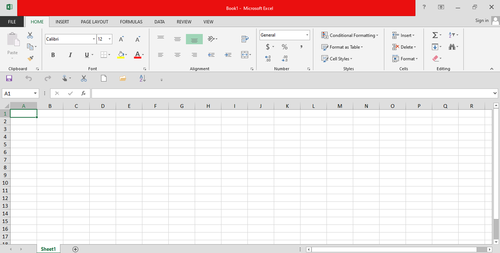
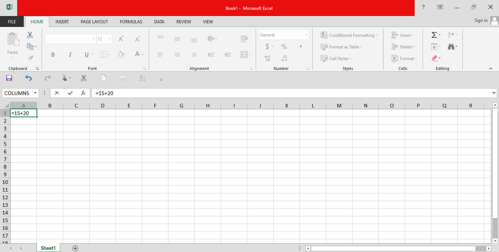
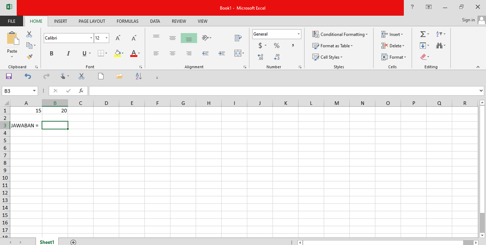
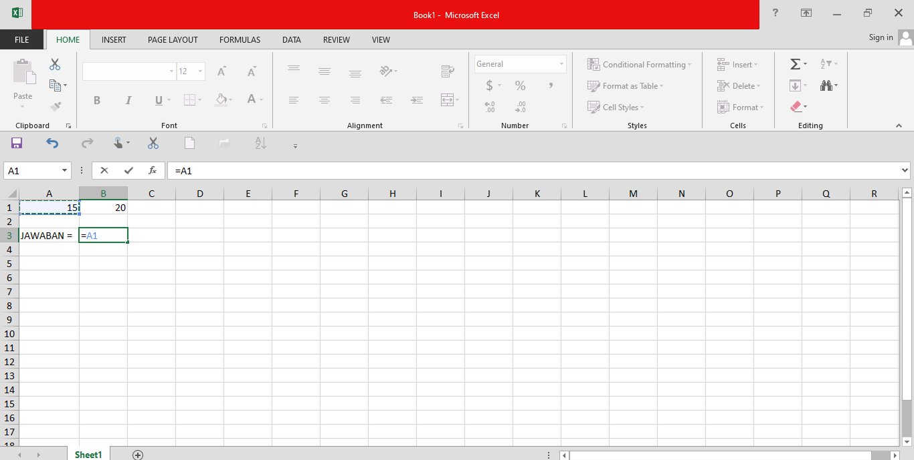
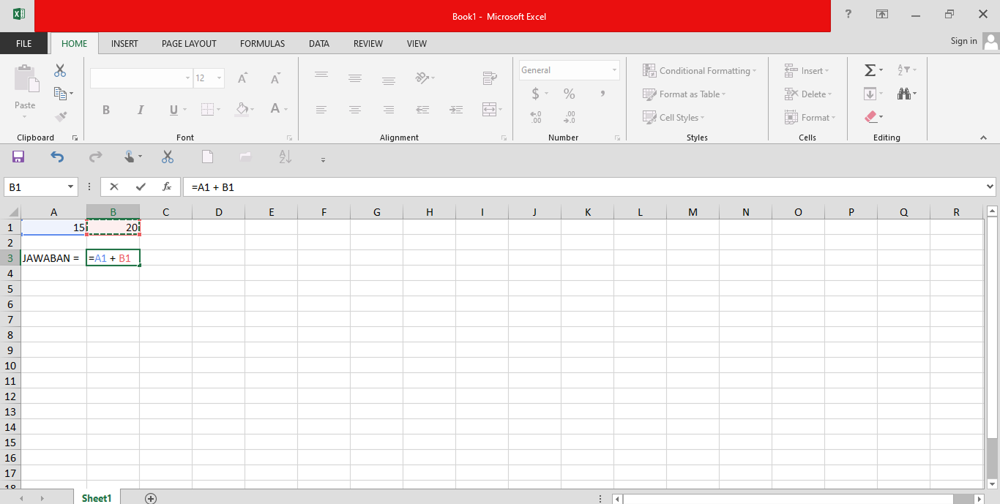

# EXCEL SINTAX

oke kali ini kita akan mempelajari sintax dari excel itu

oke jadi pada dasar nya untuk membuat rumus pada sel kita wajib mengetik `=` terlebih dahulu agar bisa membuat rumus. contoh nya gini

    `=A1 + A2`

JADI KETIKA DI ENTER MISLA DI SEL `A1` VELUE NYA `2` DAN DI SEL `A2` ITU `5` MAKA HASIL DARI CELL DENGAN RUMUS YANG KITA KETIKAN ITU ADLAH `7`

---

## Cara Membuat Rumus DI excel By Tutor

>[!NOTE]
>KALAU MAU BUAT RUMUS PASTIKAN CLIK `=` DULU

- PILIH SEL

- KETIK `=`

- MASUKAN RUMUS MISAL `15` `+` `20`

- SELAMAT RUMUS BARU ANDA BERHASIL GELOOO 

---

## Nulis rumus tapi pakai clik sell

- BUAT DULU TABEL KAYAK GINI

- BEBAS AJA ANGKANYA KALIAN
- MASUKAN `=` DI SEL SEBAS AJA (ASALKAN KOSONG SEL NYA)

- KLIK SLAAH SATU SELL

- KALAU UDAH KALIAN MASUKAN MAUITU `+` ATAU `-` ATAU `/` ATAU `*`

- TRUS PILIH 1 SEL LAGI BUAT MAU DI OEPASIKAN KE MANA MISLA NYA GINI

- TRUS KALAU DUAH KALIAN MAU ENTER ATAU MAU BUAT PENJUMLAHGAN ATAU APALAGI TERSERAH KALIAN AJA DISINI GUA LANSGUNG ENTER AJA 
  

- DAN SELAMAT ANDA TELAH MEMBUAT RUMUS SENRIRI GAMPNAG KAN

## PENUTUP 
TQ YAK YANG UDHA BACA SAMPE SINI LALU KOITA LANJUT LAGI KE

